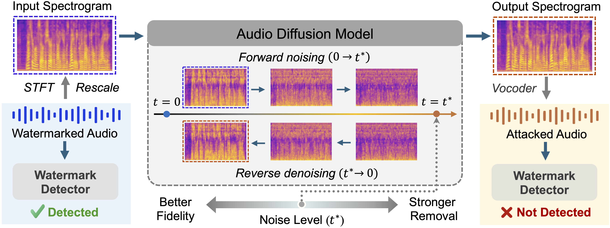

# DiffErase: Black-box Audio Watermark Removal via Diffusion Priors
This repository contains the implementation of DiffErase, a method for removing audio watermarks using diffusion-based reconstruction.



We provide two variants:

- **DiffErase-mel**: Mel-spectrogram diffusion. The diffusion model operates directly on mel-spectrograms and reconstructs audio using BigVGAN (see `DiffErase-mel/`).
- **DiffErase-latent**: Latent-space mel-spectrogram diffusion. The diffusion model operates in the latent space of mel-spectrograms and reconstructs audio using HiFi-GAN (see `DiffErase-latent/`).

## Remove watermarks with DiffErase-mel
Place pretrained DiffErase-mel checkpoints in `DiffErase-mel/models/`.

### Basic usage

```bash
python remove_differase-mel.py \
  --watermarked_dir path/to/watermarked_audio \
  --output_dir path/to/erased_audio \
  --noise_level 0.1
```

On first run, BigVGAN (`nvidia/bigvgan_v2_22khz_80band_256x`) is downloaded from Hugging Face.

## Remove watermarks with DiffErase-latent
Place pretrained DiffErase-latent checkpoints in `DiffErase-latent/data/checkpoints/`.

### Basic usage

```bash
python remove_differase-latent.py \
  --watermarked_dir path/to/watermarked_audio \
  --output_dir path/to/erased_audio \
  --noise_level 0.1
```

Here, `--watermarked_dir` is the folder containing watermarked audio to be processed; `--output_dir` is the folder for audio after watermark removal; `--noise_level` controls the diffusion noise level in [0, 1], adjust it to trade off watermark removal strength against audio quality.

👉 To listen to the demo, please refer to the [demo webpage](https://differase.github.io/DiffErase/).